# Graph Optimizer

Much of the computational work we do is represented as a data-flow graph,
where nodes in that graph perform some type of transformation on the data.
Some of these transformations exhibit arithmetic properties such as
commutative, associative, or distributive and others are not. The challenge
is to develop an optimizer that takes an input graph and modifies the graph
in such a way that the number of operations and the total cost of
operations is minimized, while producing the same results. This optimizer
should be a microservice that provides a simple API that can run alongside
other components of our stack.

## Data-Flow Graph Model

The general model of the graph consists of operations that are represented as
vertices which are connected through streams of records, the edges of the
graph. Each vertex (except *Terminal* operations) can have multiple outgoing
edges and most vertices (except *Source* and *Merge* operations) only allow for
one input edge. *Terminal* operations are vertices with no outgoing edges and
*Source* operations are vertices with no incoming edges. *Merge* operations can
have one or more incoming edges.

The streams of records are of arbitrary length and each record in the stream is
represented as a tuple of the form `(index, value)`. The `index` is a positive
integer number and `value` is any positive floating point number in the range
of `(0.0, 1000)`. Records with a `value = 0.0` are omitted from the stream.
Records in a stream are always processed in accending order of their index.

## Operations

### Terminal

The *Terminal* operation receives a single stream of records and terminates
that stream. It does not have any outputs.

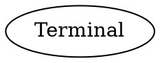

### Source

The *Source* operation generates a stream of records and has no inputs. All
operations, except *Terminal*, have the same properties as Source.

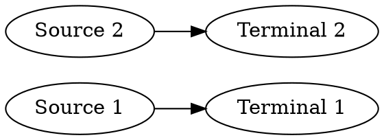

#### Distributive

Source is distributive, which means two sources that produce the same
records can be replaced by a single source.

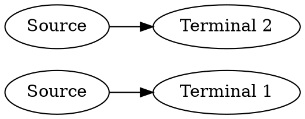
is identical to
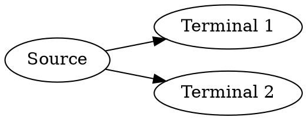


### Merge

The *Merge* operation combines two or more streams of records into a single stream of records.

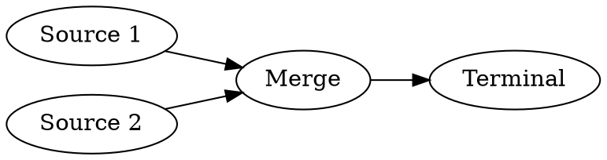

#### Commutative

The Merge operation is commutative, which means multiple subsequent merges can be reordered and even combined.


is the same as
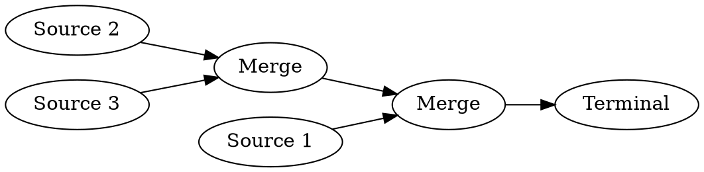
is the same as
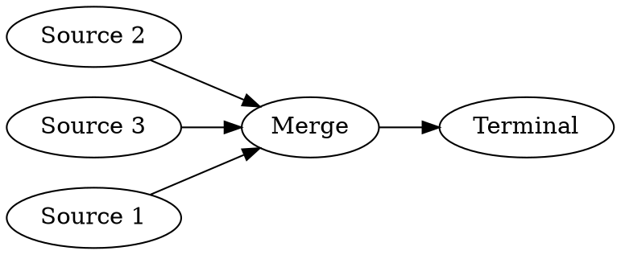

### Scale

The *Scale* operation multiplies each incoming record's value by a constant factor. 

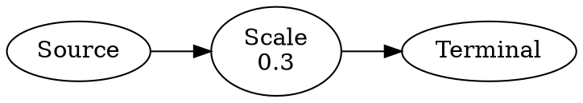

As multiplication is commutative, associative, and distributive, the Scale operation shares these properties with multiplication.

#### Commutative

The Scale operation is commutative and multiple subsequent Scale operations can be combined into one.

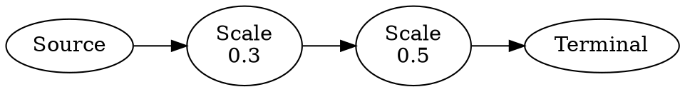
is the same as
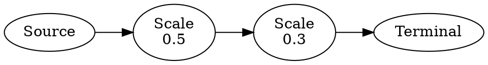
is the same as
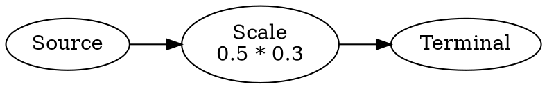

#### Associative

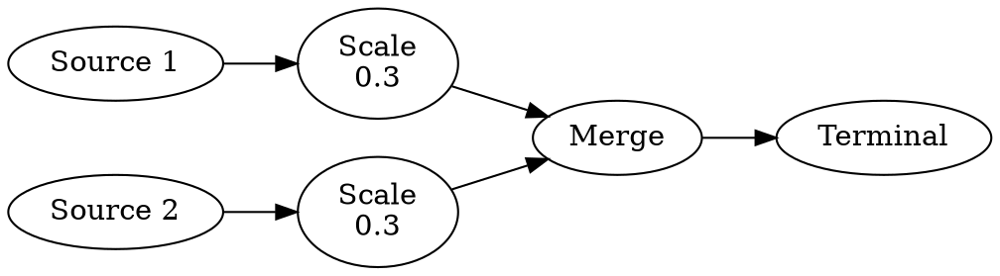
is the same as
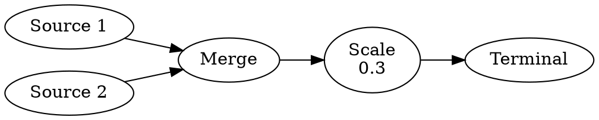

#### Distributive

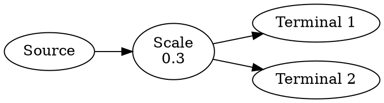
is the same as
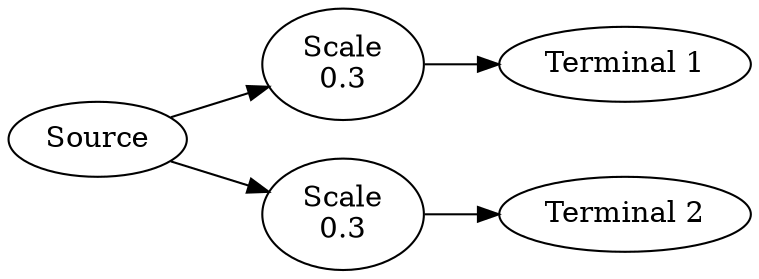

#### Special Cases for Scale

A Scale operation with a factor of `0.0` will produce an empty stream of
records. As such the input to the Scale operation is irrelevant and does not
need to be computed.

A Scale operation with a factor of `1.0` will produce a stream identical to the input stream and thus can be considered redundant.

### Filter

The *Filter* operation filters the stream of input records and outputs only
those records that match the filter critera. Filters can be inverted to output
only those records that do not match the filter criteria. 

For the purpose of this challenge, there shall only be an *IN* filter which in
the non-inverted case outputs records whose index is listed as part of the
filter constraint. In the inverted case it output all records whose index is
not listed in the filter constraint.


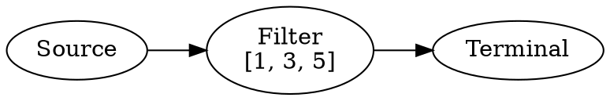

The commutative, associative, and distributive properties of the Filter
operation are identical to the Scale operation.

#### Special Cases for Filter

A *IN* Filter with an empty list of indices does not match any records and thus
produces an empty output stream. As such the input to that Filter operation is
irrelevant and does not need to be computed.

An inverted *IN* Filter with an empty list of indices matches any records and
produces an output stream identical to the input stream. It can be considered
redundant.


### Attachment

An *Attachment* operation performs the financial calculations necessary to
model an insurance deductible. That is, it reduces a sum of record values with
identical index by a specified amount and only if the difference is greater
than `0` it will output records with values proportionally allocated to the
difference. In other words, it outputs 
`(SUM(values) - attachment) * value / SUM(values)` if and only if 
`SUM(values) - attachment > 0`.

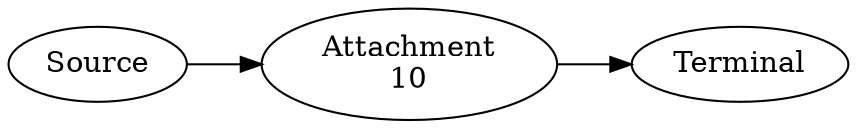

Attachment operations are commutative and distributive, but not associative.

#### Commutative

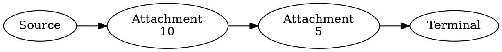
is the same as
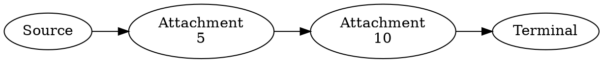
is the same as
```dot
digraph {
    rankdir=LR;
    0 [label="Source"];
    1 [label="Attachment\n15"];
    2 [label="Terminal"];
    0 -> 1 -> 2;
}
```

#### Distributive

```dot
digraph {
    rankdir=LR;
    0 [label="Source"];
    1 [label="Attachment\n10"];
    2 [label="Terminal 1"];
    3 [label="Terminal 2"];
    0 -> 1;
    1 -> 2;
    1 -> 3;
}
```
is the same as
```dot
digraph {
    rankdir=LR;
    0 [label="Source"];
    1 [label="Attachment\n10"];
    2 [label="Attachment\n10"];
    3 [label="Terminal 1"];
    4 [label="Terminal 2"];
    0 -> 1 -> 3;
    0 -> 2 -> 4;
}
```

#### Special Cases for Attachment

An *Attachment* operation of with an `attachment = 0.0` has no practical effect
and can thus be considered redundant.

An *Attachment* operation with an `attachment = 1000.0` or greater will produce
an empty output stream. As such the input to that Attachment operation is
irrelevant and does not need to be computed.

### Limit

A *Limit* operation performs the financial calculations necessary to model an insurance limit. That is, it computes the lesser of the `limit` specified by the operation and `SUM(values)` of records with identical index and then produces records with the result proportionally allocated to its input values.

```dot
digraph {
    rankdir=LR;
    0 [label="Source"];
    1 [label="Limit\n20"];
    2 [label="Terminal"];
    0 -> 1 -> 2;
}
```

Limit operations are only distributive, but not commutative or associative.

#### Distributive

```dot
digraph {
    rankdir=LR;
    0 [label="Source"];
    1 [label="Limit\n20"];
    2 [label="Terminal 1"];
    3 [label="Terminal 2"];
    0 -> 1;
    1 -> 2;
    1 -> 3;
}
```
is the same as
```dot
digraph {
    rankdir=LR;
    0 [label="Source"];
    1 [label="Limit\n20"];
    2 [label="Limit\n20"];
    3 [label="Terminal 1"];
    4 [label="Terminal 2"];
    0 -> 1 -> 3;
    0 -> 2 -> 4;
}
```

#### Special Cases for Limit

If a *Limit* operation with a `limit = X` followed by a *Limit* operation with
a `limit = Y` and `X <= Y`, then the first operation has practically no effect
and can be omitted.

A *Limit* operation with a `limit = 1000` or greater has practically no effect
and can be omitted.

A *Limit* operation with a `limit = 0` produces an empty output stream. As such
the input to that Limit operation is irrelevant and does not need to be
computed.

### Pair-Wise Commutative Properties

| Left Hand \ Right Hand | Source  | Terminal | Merge   | Scale   | Filter  | Attachment | Limit   |
|------------------------|---------|----------|---------|---------|---------|------------|---------|
| Source                 | invalid | no       | no      | no      | no      | no         | no      |
| Terminal               | invalid | invalid  | invalid | invalid | invalid | invalid    | invalid |
| Merge                  | invalid | no       | yes     | no      | no      | no         | no      |
| Scale                  | invalid | no       | no      | yes     | yes     | no         | no      |
| Filter                 | invalid | no       | no      | yes     | yes     | no         | no      |
| Attachment             | invalid | no       | no      | no      | yes     | yes        | no      |
| Limit                  | invalid | no       | no      | no      | yes     | no         | no      |

## Cost Model

The objective of the optimizer is to reduce the cost of evaluating the graph. There are two measures that determine the overall cost to evaluate the graph.

1. Number of operations: The evaluation of each operation has a fixed cost. The fixed cost of evaluating a graph can be determined by the number of vertices in the graph.
2. Number of records processed in each operation: The evaluation of each operation has a variable cost that depends on the number of records processed by that operation. The variable cost can only be determined after the evaluation of a graph as the input data is not available during the optimization process.

The total cost of evaluating a graph is `fixed_cost + variable_cost / number_of_input_records`.

### Cost Multpliers (optional)

A more advanced cost model assigns different costs to each operation, which can be incorporated into the optimization process.

| Operation  | Fixed Cost Multiplier | Variable Cost Multiplier |
|------------|-----------------------|--------------------------|
| Source     | 2                     | 2                        |
| Terminal   | 1                     | 1.5                      |
| Merge      | 1                     | 3                        |
| Scale      | 1                     | 1                        |
| Filter     | 1                     | 1                        |
| Attachment | 1                     | 2                        |
| Limit      | 1                     | 2                        |

## Useful Links

- NetworkX
- Boost.Graph
- SAM