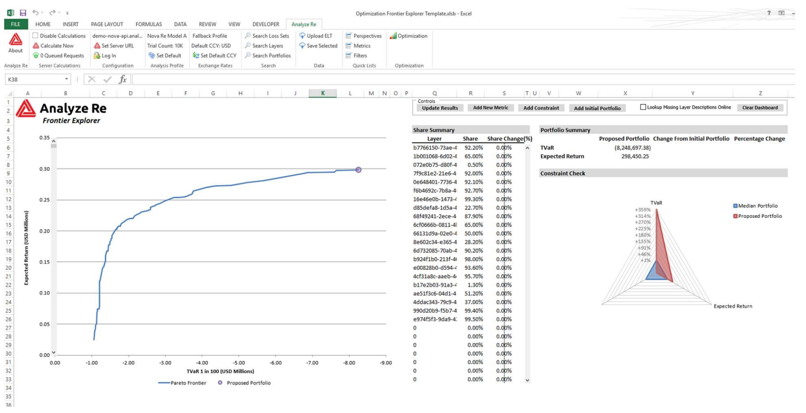

# Efficient Frontier Explorer

TODO:
- [ ] Add example data

Analyze Re's portfolio optimization component produces what is called a
multi-dimensional "Efficient Frontier" or "Pareto Frontier" of viable solutions
that satisfy certain optimization objectives and constraints. We currently have
the ability to visualize that frontier in Excel using 2D plots of a selected
pair of dimensions. The challenge is to provide similar capabilities via a Web
interface.

## Objectives

- Conceptualize and prototype a Web UI that allows users to interactively explore the efficient frontier and get detailed information on each candidate solution
- Load optimization result data in JSON format
- Display additional information about each candidate by querying the Analyze Re API
- Allow for more than two optimization objectives (multi-dimensional)

## API Specification

The [Analyze Re REST API documentation](http://docs.analyzere.net/) describes how
[Optimizations](http://docs.analyzere.net/?http#optimization-views) are created
on the Analyze Re platform. It provides some examples code of how to initiated an optimization and retrieve the Efficient Frontier.

## Example Data Sets

A JSON file containing the Efficient Frontier of an optimization run:
- [optimization.json](optimization.json)

A URL to an existing *Optimization View* on the Analyze Re platform:
- Optimized Portfolio (https://hackaton-api.analyzere.net/optimization_views/6c596386-c496-48f2-b176-1c19f7207d53)

## Useful Links

- [Analyze Re REST API Documentation](http://docs.analyzere.net/)
- [Angular JavaScript Framework](https://angular.io/)
- [React JavaScript Framework](https://reactjs.org/)
- [Bokeh](https://bokeh.pydata.org/en/latest/) - Interactive visualizations in Python
- [D3.js Data-Driven Documents](https://d3js.org/)
